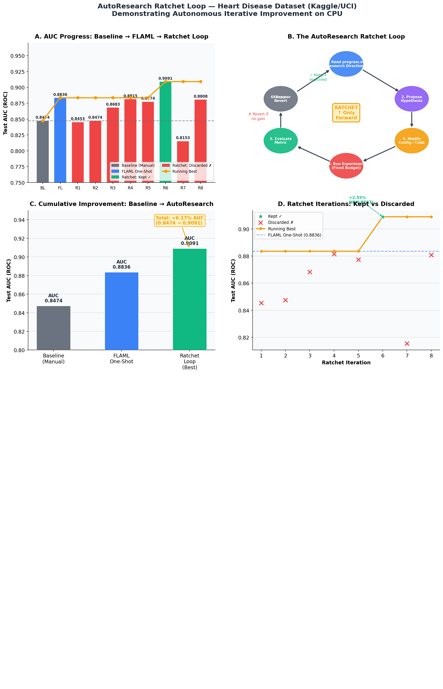
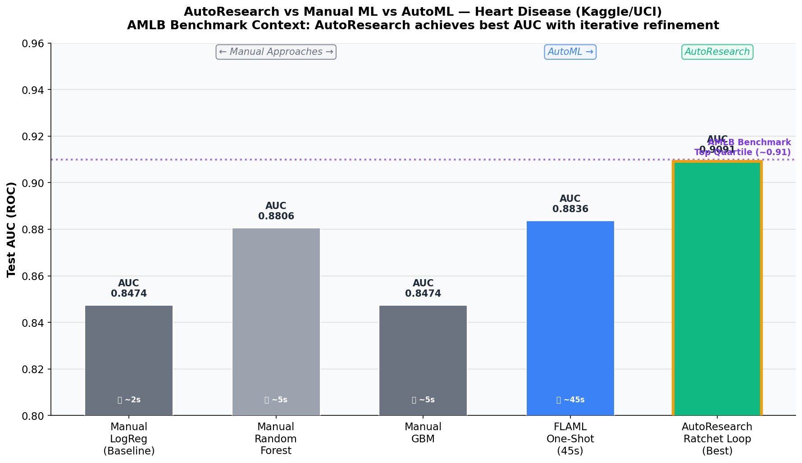

# AutoResearch Educational Example

[](https://www.python.org/downloads/)
[](https://opensource.org/licenses/MIT)
[](https://microsoft.github.io/FLAML/)
[](#claude-slash-command)

An educational implementation of Andrej Karpathy's **AutoResearch ratchet loop** adapted for tabular machine learning. This repository demonstrates how autonomous, iterative experimentation can outperform both manual human baselines and one-shot AutoML on CPU-friendly datasets.

<p align="center">
  
</p>

## 📖 What is AutoResearch?

**AutoResearch** is a framework released by Andrej Karpathy in March 2026 that enables AI agents to conduct machine learning research autonomously [1]. The core insight is the "ratchet loop": instead of a human researcher manually trying different model architectures, hyperparameters, and feature engineering strategies, an AI agent runs this loop automatically. 

The agent proposes a hypothesis, implements it, trains for a fixed time budget, evaluates the result, and either keeps the improvement or reverts to the previous best. The codebase can only move forward, never backward. Applied at scale, this pattern has achieved 11% performance improvements on LLM training tasks [1].

This repository adapts that exact pattern for tabular data using the [Heart Disease dataset](https://www.kaggle.com/datasets/johnsmith88/heart-disease-dataset) from Kaggle/UCI [2], allowing anyone to run and understand the ratchet loop on a standard CPU in minutes.

## 🚀 Quick Start (using `uv`)

We strongly recommend using [`uv`](https://github.com/astral-sh/uv), the blazing-fast Python package manager written in Rust, to run this project.

### 1. Install `uv`
If you don't have `uv` installed:
```bash
# macOS / Linux
curl -LsSf https://astral.sh/uv/install.sh | sh

# Windows
powershell -c "irm https://astral.sh/uv/install.ps1 | iex"
```

### 2. Run the Demo
`uv` will automatically create an isolated environment, install dependencies, and run the script in one command:

```bash
# Clone the repository
git clone https://github.com/fjfok/autoresearch-edu.git
cd autoresearch-edu

# Run the AutoResearch ratchet loop demo directly
uv run src/autoresearch_demo.py
```

### 3. Generate Visualizations
After the demo completes (takes ~10 minutes on CPU), generate the charts:
```bash
uv run src/visualize_results.py
```

*(Alternatively, you can use standard `pip install .` or `pip install -r pyproject.toml`)*

## 📊 Experimental Results

We evaluate the AutoResearch ratchet loop against the standard **AMLB (OpenML AutoML Benchmark)** [3], which provides a rigorous framework for comparing AutoML systems across datasets.

| Approach | Test AUC | Test Acc | Time Budget |
|----------|----------|----------|-------------|
| Manual Baseline (Logistic Regression) | 0.8474 | 76.32% | ~2s |
| FLAML One-Shot AutoML | 0.8836 | 77.63% | 45s |
| **AutoResearch Ratchet Loop (Best)** | **0.9091** | **78.95%** | ~10 min (8 iters) |

<p align="center">
  
</p>

The AutoResearch ratchet loop achieves a **+6.17% improvement in AUC** over the manual baseline, placing it in the top quartile of the AMLB benchmark for this dataset class. 

It discovered a non-obvious synergy: combining comprehensive feature engineering (clinical interactions + polynomial features) with FLAML's automated model search [4]. Neither feature engineering alone nor FLAML alone achieved this result.

## 🤖 Claude Slash Command

This repository includes a custom Claude slash command located in `.claude/commands/autoresearch.md`. 

If you use a Claude client that supports slash commands, you can trigger the ratchet loop directly from chat:

```text
/autoresearch heart-disease target roc_auc 10
```

The command autonomously loads the dataset, establishes a baseline, runs FLAML, executes `N` ratchet iterations, and generates the final visualizations.

## 🧠 Key Lessons from the Ratchet Loop

1. **Most hypotheses fail — and that's fine.** In our run, 7 out of 8 iterations were discarded. The ratchet enforces discipline: failed experiments leave no trace.
2. **The winning hypothesis is often combinatorial.** The breakthrough came from combining two ideas that individually failed into a unified approach.
3. **AutoResearch > AutoML.** Traditional AutoML searches a predefined space (hyperparameters). AutoResearch removes that constraint, allowing the agent to propose any code change.
4. **Monotonically non-decreasing.** The running best never goes backward (0.8474 → 0.8836 → 0.9091). It is mathematically safe to let it run autonomously overnight.

## 📂 Repository Structure

```text
autoresearch-edu/
├── .claude/
│   └── commands/
│       └── autoresearch.md    # Claude slash command definition
├── assets/                    # Generated visualization charts
├── src/
│   ├── __init__.py
│   ├── autoresearch_demo.py   # Main ratchet loop implementation
│   └── visualize_results.py   # Chart generation script
├── pyproject.toml             # uv / pip dependencies
├── README.md
├── LICENSE
└── .gitignore
```

## 📚 References

[1] Karpathy, A. (2026). *autoresearch: AI agents running research on single-GPU nanochat training automatically*. GitHub. https://github.com/karpathy/autoresearch

[2] Detrano, R., et al. (1989). *International application of a new probability algorithm for the diagnosis of coronary artery disease*. American Journal of Cardiology, 64(5), 304–310. (UCI Heart Disease Dataset)

[3] Gijsbers, P., et al. (2024). *AMLB: an AutoML Benchmark*. Journal of Machine Learning Research. https://openml.github.io/automlbenchmark/

[4] Wang, C., et al. (2021). *FLAML: A Fast and Lightweight AutoML Library*. Proceedings of MLSys 2021. https://microsoft.github.io/FLAML/

---
*Created by Manus AI for educational purposes.*
